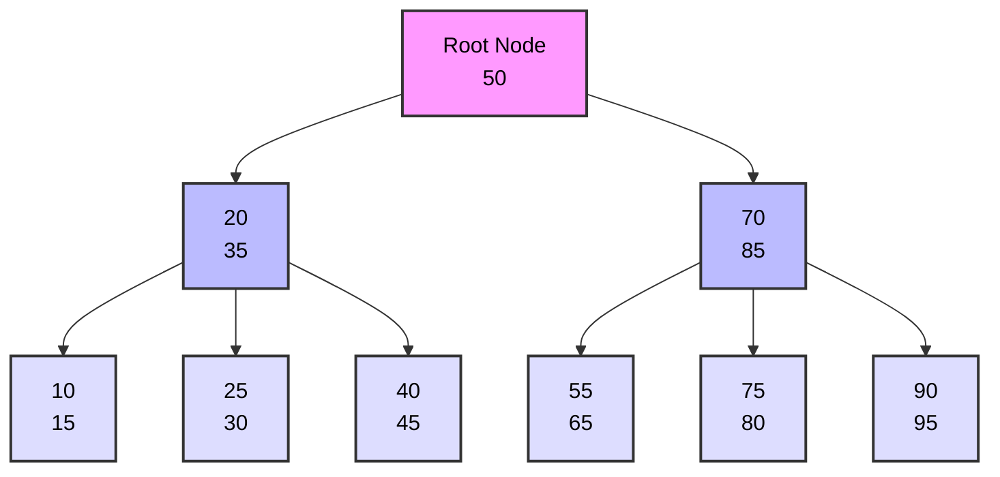

# B-tree Indexes in PostgreSQL

## What is a B-tree Index?

A B-tree (Balanced Tree) index is the default and most commonly used index type in PostgreSQL. It's a self-balancing tree data structure that maintains sorted data and allows for efficient insertions, deletions, and searches.

### B-tree Structure Example



The diagram above shows a simple B-tree structure where:
- The root node (pink) contains the middle value
- Internal nodes (blue) contain sorted values and pointers to child nodes
- Leaf nodes (light blue) contain the actual data values
- All leaf nodes are at the same level, ensuring the tree is balanced
- Values are sorted from left to right, making range queries efficient

## When to Use B-tree Indexes?

B-tree indexes are ideal for:

1. **Equality Comparisons**
   - Exact matches (`column = value`)
   - Primary keys and unique constraints

2. **Range Queries**
   - Less than (`<`)
   - Greater than (`>`)
   - Between operations
   - LIKE queries with pattern at the end (e.g., 'abc%')

3. **Sorting Operations**
   - ORDER BY clauses
   - GROUP BY clauses

## Why Use B-tree Indexes?

### Advantages:
- Fast lookups (O(log n) complexity)
- Maintains sorted order
- Supports both equality and range queries
- Works well with unique constraints
- Handles NULL values efficiently
- Supports multi-column indexes

### Best For:
- High-cardinality columns (many unique values)
- Columns frequently used in WHERE clauses
- Columns used in JOIN conditions
- Columns used in ORDER BY or GROUP BY

## How to Create B-tree Indexes

### Basic Syntax:
```sql
CREATE INDEX index_name ON table_name (column_name);
```

### Examples:

1. **Single Column Index:**
```sql
CREATE INDEX idx_users_email ON users(email);
```

2. **Multi-Column Index:**
```sql
CREATE INDEX idx_users_name ON users(last_name, first_name);
```

3. **Unique Index:**
```sql
CREATE UNIQUE INDEX idx_users_username ON users(username);
```

## Performance Considerations

1. **When B-tree Indexes Help:**
   - Selective queries (returning small portion of data)
   - Frequent range queries
   - Sorting operations
   - Join operations

2. **When B-tree Indexes Might Not Help:**
   - Low-cardinality columns
   - Tables with frequent INSERT/UPDATE operations
   - Small tables (< 1000 rows)
   - Queries returning large portions of the table

## Maintenance

1. **Regular Maintenance:**
```sql
VACUUM ANALYZE table_name;
REINDEX INDEX index_name;
```

2. **Monitoring Index Usage:**
```sql
SELECT schemaname, tablename, indexname, idx_scan, idx_tup_read, idx_tup_fetch 
FROM pg_stat_user_indexes;
```

## Best Practices

1. **Index Creation:**
   - Create indexes during low-traffic periods
   - Consider CONCURRENTLY option for production
   - Don't over-index (each index adds overhead)

2. **Column Order in Multi-Column Indexes:**
   - Most selective columns first
   - Most frequently queried columns first
   - Consider query patterns

3. **Regular Monitoring:**
   - Check index size
   - Monitor index usage
   - Analyze query performance

## Common Use Cases

1. **Primary Keys**
```sql
CREATE TABLE users (
    id SERIAL PRIMARY KEY,  -- Automatically creates B-tree index
    username VARCHAR(50)
);
```

2. **Foreign Keys**
```sql
CREATE INDEX idx_orders_user_id ON orders(user_id);
```

3. **Search Optimization**
```sql
CREATE INDEX idx_products_name ON products(name);
```

## Limitations

1. **Size:**
   - Indexes increase database size
   - Each index requires additional disk space

2. **Maintenance:**
   - Indexes slow down INSERT, UPDATE, DELETE operations
   - Regular VACUUM and ANALYZE required

3. **Not Suitable For:**
   - Full-text search (use GIN/GiST instead)
   - Geometric data (use GiST)
   - Very large range scans 