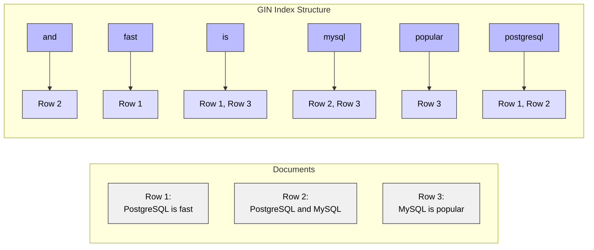

# GIN (Generalized Inverted Index) in PostgreSQL

## What is a GIN Index?

A GIN (Generalized Inverted Index) is a specialized index structure designed for handling cases where multiple values are stored in a single column, such as arrays, full-text search documents, and JSON data. It creates an index entry for each component value (array element, text token, or JSON key) with a list of row IDs where that value appears.

### How GIN Maps Values to Rows

GIN works by creating an inverted index, which maps each individual value (word, array element, or JSON key) to a list of rows where that value appears. Here's a visualization:



#### How It Works:
1. **Document Storage**: Each row in the table contains the full text/array/JSON data
2. **Value Extraction**: GIN breaks down the content into individual values:
   - For text: words or lexemes
   - For arrays: individual elements
   - For JSON: keys and values
3. **Inverted Mapping**: Creates a mapping where:
   - Keys are the individual values
   - Values are lists of row IDs where those values appear
4. **Fast Lookups**: When searching:
   - Finds the relevant values in the index
   - Gets the intersection/union of row IDs
   - Retrieves only matching rows

This structure makes GIN extremely efficient for:
- Full-text search (finding all documents containing specific words)
- Array containment (@> operator)
- JSON key/value lookups
- Complex queries involving multiple values

## When to Use GIN Indexes?

GIN indexes are ideal for:

1. **Full-Text Search**
   - Document searching
   - Pattern matching
   - Language-specific text search

2. **Array Operations**
   - Array containment (@>)
   - Array overlap (&&)
   - Array element equality (=)

3. **JSON/JSONB Data**
   - Key-value lookups
   - Containment queries
   - Path expressions

## Why Use GIN Indexes?

### Advantages:
- Excellent for searching within composite values
- Handles full-text search efficiently
- Perfect for array and JSON operations
- Supports complex containment queries
- High performance for many-to-many searches
- Good compression for repetitive values

### Best For:
- Text search columns (tsvector)
- Array columns
- JSONB columns
- Composite type searches
- High-cardinality multi-value columns
- Complex containment queries

## How to Create GIN Indexes

### Basic Syntax:
```sql
CREATE INDEX index_name ON table_name USING GIN (column_name);
```

### Examples:

1. **Full-Text Search Index:**
```sql
CREATE INDEX idx_documents_text ON documents 
USING GIN (to_tsvector('english', content));
```

2. **Array Index:**
```sql
CREATE INDEX idx_products_tags ON products 
USING GIN (tags);
```

3. **JSONB Index:**
```sql
CREATE INDEX idx_data_json ON data 
USING GIN (jsonb_content);
```

## Performance Considerations

1. **When GIN Indexes Help:**
   - Full-text search operations
   - Array containment checks
   - JSON path queries
   - Complex pattern matching
   - Many-to-many relationships

2. **When GIN Indexes Don't Help:**
   - Simple equality comparisons
   - Range queries on scalar values
   - Small tables
   - Frequently updated columns

## Maintenance

1. **Monitoring Index Size:**
```sql
SELECT pg_size_pretty(pg_relation_size('index_name'));
```

2. **Fast Updates with Pending List:**
```sql
-- Set pending list size (default is 4MB)
ALTER INDEX index_name SET (fastupdate = on, gin_pending_list_limit = 8MB);
```

3. **Cleaning Pending List:**
```sql
VACUUM table_name;
```

## Best Practices

1. **Index Creation:**
   - Use partial indexes when possible
   - Consider maintenance overhead
   - Monitor index size
   - Use appropriate opclass

2. **Configuration:**
   - Adjust work_mem for better build performance
   - Configure maintenance_work_mem appropriately
   - Consider fastupdate setting
   - Monitor pending list size

3. **Usage Guidelines:**
   - Create custom operators if needed
   - Use appropriate search patterns
   - Consider column cardinality
   - Plan for update overhead

## Common Use Cases

1. **Full-Text Search**
```sql
CREATE TABLE articles (
    id SERIAL PRIMARY KEY,
    title TEXT,
    content TEXT
);

CREATE INDEX idx_articles_fts ON articles 
USING GIN (to_tsvector('english', title || ' ' || content));

-- Search query
SELECT title 
FROM articles 
WHERE to_tsvector('english', title || ' ' || content) @@ 
      to_tsquery('english', 'postgresql & indexing');
```

2. **Array Search**
```sql
CREATE TABLE products (
    id SERIAL PRIMARY KEY,
    name TEXT,
    categories TEXT[]
);

CREATE INDEX idx_products_categories ON products 
USING GIN (categories);

-- Array containment query
SELECT name 
FROM products 
WHERE categories @> ARRAY['electronics', 'wireless'];
```

3. **JSONB Queries**
```sql
CREATE TABLE events (
    id SERIAL PRIMARY KEY,
    data JSONB
);

CREATE INDEX idx_events_data ON events 
USING GIN (data);

-- JSON containment query
SELECT * 
FROM events 
WHERE data @> '{"status": "active", "type": "user_login"}';
```

## Limitations

1. **Size and Performance:**
   - Larger than B-tree indexes
   - Slower index creation
   - Update overhead
   - Memory intensive

2. **Functionality:**
   - No range scan support
   - Limited to supported operators
   - Update-intensive workloads may suffer
   - Higher maintenance overhead

3. **Specific Limitations:**
   - Not suitable for simple scalar comparisons
   - Complex configuration needed
   - Higher storage requirements
   - Slower updates than B-tree

## Advanced Features

1. **Custom Operators**
```sql
-- Creating a custom operator class
CREATE OPERATOR CLASS my_op_class
FOR TYPE custom_type
USING gin AS
OPERATOR 1 <custom_operator>;
```

2. **Partial Indexes**
```sql
CREATE INDEX idx_partial_gin ON table_name 
USING GIN (column) 
WHERE condition;
```

3. **Expression Indexes**
```sql
CREATE INDEX idx_gin_expression ON table_name 
USING GIN (expression(column));
```

## Performance Tuning

1. **Configuration Settings**
```sql
-- Adjust work memory for index creation
SET maintenance_work_mem = '1GB';

-- Configure GIN pending list limit
ALTER INDEX index_name SET (gin_pending_list_limit = '16MB');
```

2. **Monitoring**
```sql
-- Check index usage
SELECT schemaname, tablename, indexname, idx_scan, idx_tup_read
FROM pg_stat_user_indexes
WHERE indexname LIKE '%gin%';
```

3. **Optimization Tips**
```sql
-- Force GIN index usage
SET enable_seqscan = off;

-- Analyze table for better statistics
ANALYZE table_name;
```

## Tips and Tricks

1. **Combining with Other Indexes**
```sql
-- Multiple indexes for different access patterns
CREATE INDEX idx_gin_content ON documents 
USING GIN (to_tsvector('english', content));

CREATE INDEX idx_btree_date ON documents (created_at);
```

2. **Debugging**
```sql
-- Check index size and usage
SELECT pg_size_pretty(pg_relation_size('index_name')) as size,
       idx_scan as number_of_scans
FROM pg_stat_user_indexes
WHERE indexname = 'index_name';
```

3. **Maintenance Schedule**
```sql
-- Regular maintenance
VACUUM ANALYZE table_name;
REINDEX INDEX index_name;
```
