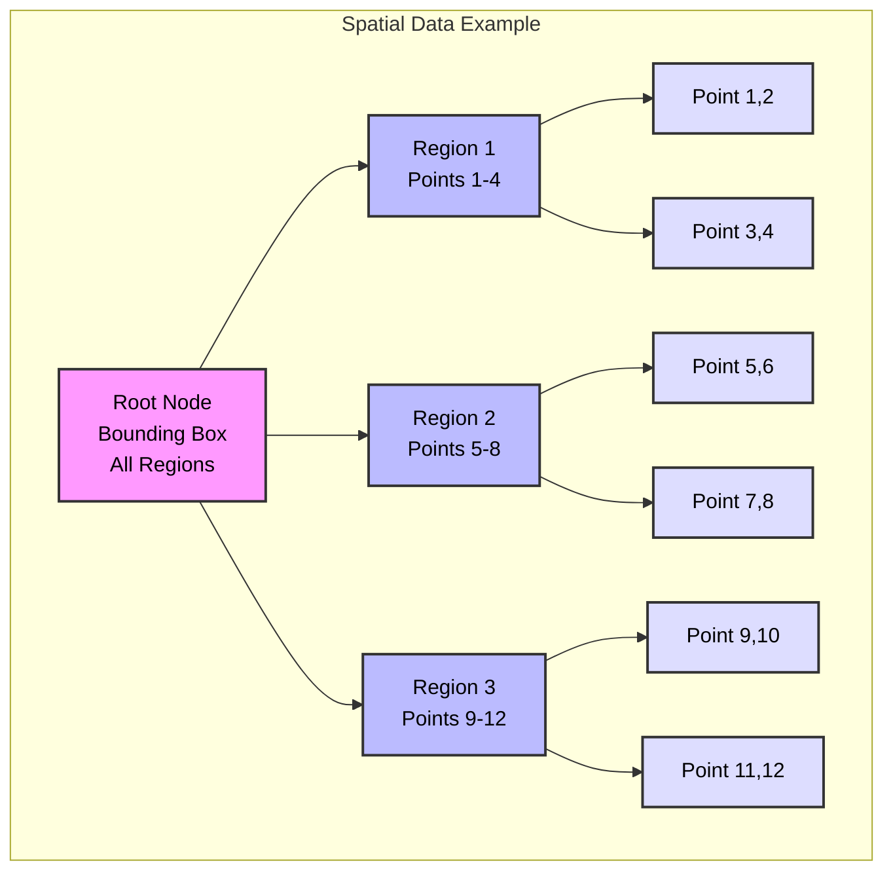
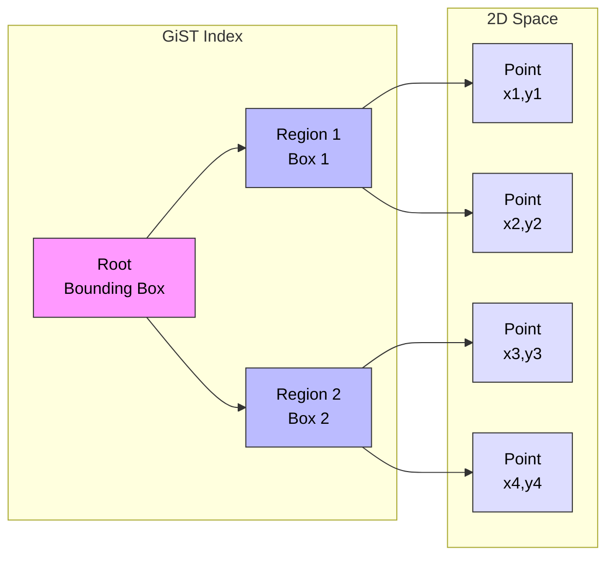

# GiST (Generalized Search Tree) Indexes in PostgreSQL

## What is a GiST Index?

A GiST (Generalized Search Tree) index is a height-balanced tree structure that serves as a template for implementing arbitrary indexing schemes. Unlike B-tree or Hash indexes, GiST can support any type of data and query as long as the data can be arranged in a hierarchical tree-like structure with a defined set of operations.

### GiST Structure Example



### How GiST Works with Geometric Data



## When to Use GiST Indexes?

GiST indexes are ideal for:

1. **Geometric Data**
   - Points, lines, polygons
   - Spatial queries
   - Geographic information systems (GIS)

2. **Custom Data Types**
   - Range types
   - Custom operators
   - Extensible indexing

3. **Specialized Queries**
   - Nearest neighbor searches
   - Containment queries
   - Intersection operations

## Why Use GiST Indexes?

### Advantages:
- Supports complex data types
- Extensible for custom indexing needs
- Efficient for spatial queries
- Handles overlapping ranges well
- Perfect for nearest-neighbor searches
- Supports exclusion constraints

### Best For:
- Geometric data types
- Range types
- Custom data types
- Multi-dimensional data
- Spatial applications
- Exclusion constraints

## How to Create GiST Indexes

### Basic Syntax:
```sql
CREATE INDEX index_name ON table_name USING GIST (column_name);
```

### Examples:

1. **Geometric Index:**
```sql
CREATE INDEX idx_locations_position 
ON locations USING GIST (position);
```

2. **Range Type Index:**
```sql
CREATE INDEX idx_reservations_daterange 
ON reservations USING GIST (timespan);
```

3. **Exclusion Constraint:**
```sql
CREATE TABLE meetings (
    room_id INT,
    during TSRANGE,
    EXCLUDE USING GIST (room_id WITH =, during WITH &&)
);
```

## Performance Considerations

1. **When GiST Indexes Help:**
   - Spatial queries
   - Range overlaps
   - Nearest-neighbor searches
   - Custom operator classes
   - Exclusion constraints

2. **When GiST Indexes Don't Help:**
   - Simple equality comparisons
   - Standard numeric ranges
   - Small datasets
   - High-update scenarios

## Maintenance

1. **Regular Maintenance:**
```sql
VACUUM ANALYZE table_name;
REINDEX INDEX index_name;
```

2. **Monitoring Index Usage:**
```sql
SELECT schemaname, tablename, indexname, idx_scan 
FROM pg_stat_user_indexes 
WHERE indexname LIKE '%gist%';
```

## Best Practices

1. **Index Creation:**
   - Consider data distribution
   - Use appropriate operator classes
   - Monitor index size
   - Plan for maintenance

2. **Query Optimization:**
   - Use appropriate operators
   - Consider index-only scans
   - Monitor query performance
   - Use EXPLAIN ANALYZE

3. **Data Organization:**
   - Cluster related data
   - Consider partitioning
   - Regular maintenance
   - Monitor page splits

## Common Use Cases

1. **Geographic Information Systems**
```sql
CREATE TABLE points_of_interest (
    id SERIAL PRIMARY KEY,
    name TEXT,
    location POINT,
    area POLYGON
);

CREATE INDEX idx_poi_location ON points_of_interest 
USING GIST (location);
```

2. **Time Range Management**
```sql
CREATE TABLE reservations (
    id SERIAL PRIMARY KEY,
    room_id INTEGER,
    period TSRANGE,
    EXCLUDE USING GIST (room_id WITH =, period WITH &&)
);
```

3. **Nearest Neighbor Search**
```sql
CREATE TABLE stores (
    id SERIAL PRIMARY KEY,
    location POINT
);

CREATE INDEX idx_stores_location ON stores 
USING GIST (location);

-- Find nearest stores
SELECT id, location 
FROM stores 
ORDER BY location <-> POINT(0,0) 
LIMIT 5;
```

## Limitations

1. **Performance:**
   - Slower than B-tree for equality
   - Higher maintenance overhead
   - Larger index size
   - Complex balancing operations

2. **Functionality:**
   - Limited to supported operators
   - Complex configuration needed
   - Requires operator class support
   - May need custom development

3. **Maintenance:**
   - Regular VACUUM required
   - Index rebuilds needed
   - Page splits can be expensive
   - Memory intensive

## Advanced Features

1. **Custom Operator Classes**
```sql
CREATE OPERATOR CLASS my_op_class
FOR TYPE custom_type
USING gist AS
OPERATOR 1 <custom_operator>;
```

2. **Clustering**
```sql
CLUSTER table_name USING index_name;
```

3. **Partial Indexes**
```sql
CREATE INDEX idx_partial_gist 
ON table_name USING GIST (column) 
WHERE condition;
```

## Tips and Tricks

1. **Performance Tuning**
```sql
-- Adjust work memory for better performance
SET maintenance_work_mem = '256MB';

-- Force index usage
SET enable_seqscan = off;
```

2. **Monitoring**
```sql
-- Check index size and usage
SELECT pg_size_pretty(pg_relation_size('index_name')) as size,
       idx_scan as number_of_scans
FROM pg_stat_user_indexes
WHERE indexname = 'index_name';
```

3. **Debugging**
```sql
-- Analyze query performance
EXPLAIN ANALYZE
SELECT * FROM points_of_interest
WHERE location <@ polygon_area;
```
