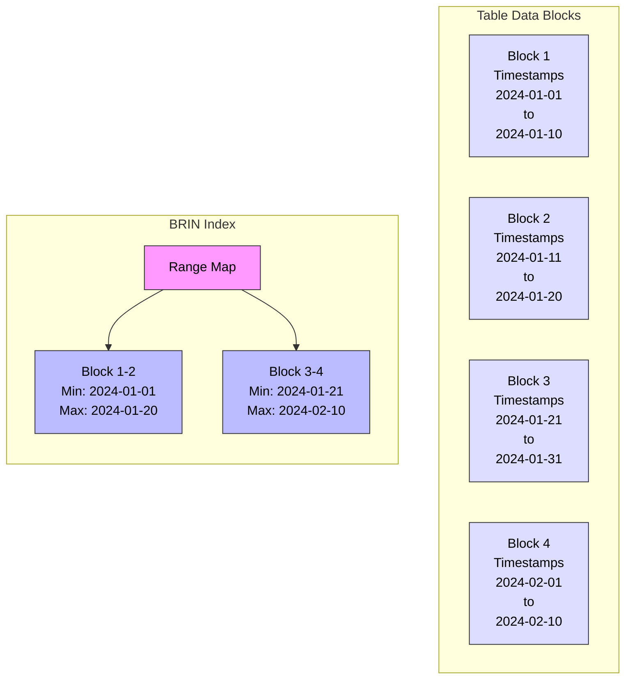
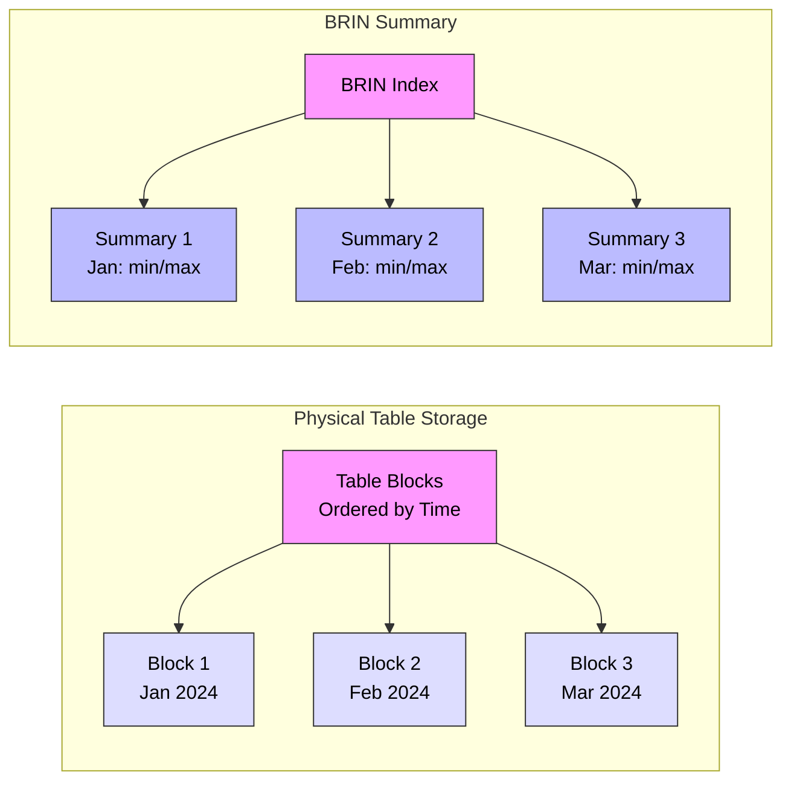

# BRIN (Block Range INdex) Indexes in PostgreSQL

## What is a BRIN Index?

A BRIN (Block Range INdex) is a tiny but powerful index type designed for handling very large tables in which the data has a natural correlation with its physical location within the table. Instead of storing every value like B-tree indexes, BRIN stores summary information about blocks of data, making it extremely space-efficient.

### BRIN Structure Example



### How BRIN Works with Time-Series Data



## When to Use BRIN Indexes?

BRIN indexes are ideal for:

1. **Large Tables**
   - Tables with millions of rows
   - Time-series data
   - Sequential data patterns

2. **Correlated Data**
   - Timestamps
   - Sequential IDs
   - Geographic coordinates by region

3. **Range Queries**
   - Date ranges
   - Numeric ranges
   - Sequential scans optimization

## Why Use BRIN Indexes?

### Advantages:
- Extremely small index size
- Minimal maintenance overhead
- Perfect for time-series data
- Efficient for large range scans
- Low impact on insert performance
- Works well with compressed data

### Best For:
- Very large tables (100GB+)
- Naturally ordered data
- Time-series applications
- Data warehouse queries
- Archival data
- Sequential scan optimization

## How to Create BRIN Indexes

### Basic Syntax:
```sql
CREATE INDEX index_name ON table_name USING BRIN (column_name);
```

### Examples:

1. **Timestamp Index:**
```sql
CREATE INDEX idx_logs_timestamp 
ON logs USING BRIN (created_at);
```

2. **Range with Block Size:**
```sql
CREATE INDEX idx_metrics_time 
ON metrics USING BRIN (
    time_stamp
) WITH (pages_per_range = 128);
```

3. **Multi-Column BRIN:**
```sql
CREATE INDEX idx_temperature_readings 
ON sensor_data USING BRIN (
    location_id,
    reading_time,
    temperature
);
```

## Performance Considerations

1. **When BRIN Indexes Help:**
   - Large range scans
   - Sequential data access
   - Time-series queries
   - Data warehouse operations
   - Archival data queries

2. **When BRIN Indexes Don't Help:**
   - Random data distribution
   - Point queries
   - Small tables
   - Frequently updated middle blocks

## Maintenance

1. **Regular Maintenance:**
```sql
-- Update summary info for modified ranges
VACUUM ANALYZE table_name;

-- Summarize any unsummarized ranges
SELECT brin_summarize_new_values('index_name');
```

2. **Monitoring Index Size:**
```sql
SELECT pg_size_pretty(pg_relation_size('index_name'));
```

## Best Practices

1. **Index Creation:**
   - Choose appropriate pages_per_range
   - Consider data correlation
   - Monitor query patterns
   - Test different configurations

2. **Data Organization:**
   - Keep correlated data together
   - Use time-based partitioning
   - Regular maintenance
   - Monitor data distribution

3. **Query Optimization:**
   - Use range-based queries
   - Consider scan costs
   - Monitor query plans
   - Adjust work_mem if needed

## Common Use Cases

1. **Time-Series Data**
```sql
CREATE TABLE metrics (
    id BIGSERIAL,
    timestamp TIMESTAMP,
    value NUMERIC,
    sensor_id INTEGER
);

CREATE INDEX idx_metrics_time 
ON metrics USING BRIN (timestamp)
WITH (pages_per_range = 64);
```

2. **Log Analysis**
```sql
CREATE TABLE logs (
    id BIGSERIAL,
    created_at TIMESTAMP,
    level TEXT,
    message TEXT
);

CREATE INDEX idx_logs_time 
ON logs USING BRIN (created_at);
```

3. **Sequential Data**
```sql
CREATE TABLE readings (
    reading_id BIGSERIAL,
    location_id INTEGER,
    temperature NUMERIC,
    read_time TIMESTAMP
);

CREATE INDEX idx_readings_location_time 
ON readings USING BRIN (location_id, read_time);
```

## Limitations

1. **Data Requirements:**
   - Needs correlated data
   - Works best with sequential patterns
   - Not suitable for random data
   - Limited selectivity

2. **Query Types:**
   - Not efficient for point queries
   - Poor performance on random access
   - Limited to range scans
   - No support for unique constraints

3. **Performance:**
   - Higher I/O for selective queries
   - Block-level granularity only
   - May read unnecessary blocks
   - Not suitable for OLTP workloads

## Advanced Features

1. **Custom Range Settings**
```sql
-- Adjust pages per range
CREATE INDEX idx_custom_range 
ON table_name USING BRIN (column_name) 
WITH (pages_per_range = 256);
```

2. **Multi-Column Support**
```sql
CREATE INDEX idx_multi_column 
ON table_name USING BRIN (
    column1,
    column2,
    column3
);
```

3. **Partial Indexes**
```sql
CREATE INDEX idx_partial_brin 
ON table_name USING BRIN (column_name) 
WHERE condition;
```

## Tips and Tricks

1. **Optimizing Range Size**
```sql
-- Calculate optimal pages_per_range
SELECT ceil(table_size / (16 * 1024))::integer AS optimal_pages_per_range
FROM (
    SELECT pg_relation_size('table_name') AS table_size
) s;
```

2. **Monitoring Effectiveness**
```sql
-- Check BRIN index usage
SELECT schemaname, tablename, indexname,
       idx_scan, idx_tup_read, idx_tup_fetch
FROM pg_stat_user_indexes
WHERE indexname LIKE '%brin%';
```

3. **Performance Testing**
```sql
-- Compare with and without index
EXPLAIN ANALYZE
SELECT * FROM large_table
WHERE timestamp BETWEEN '2024-01-01' AND '2024-01-31';
```
