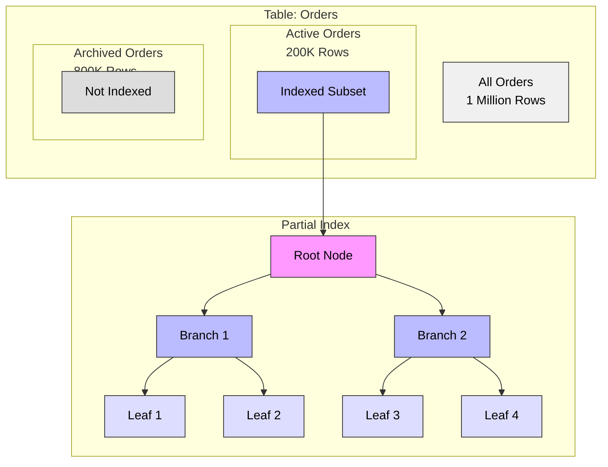
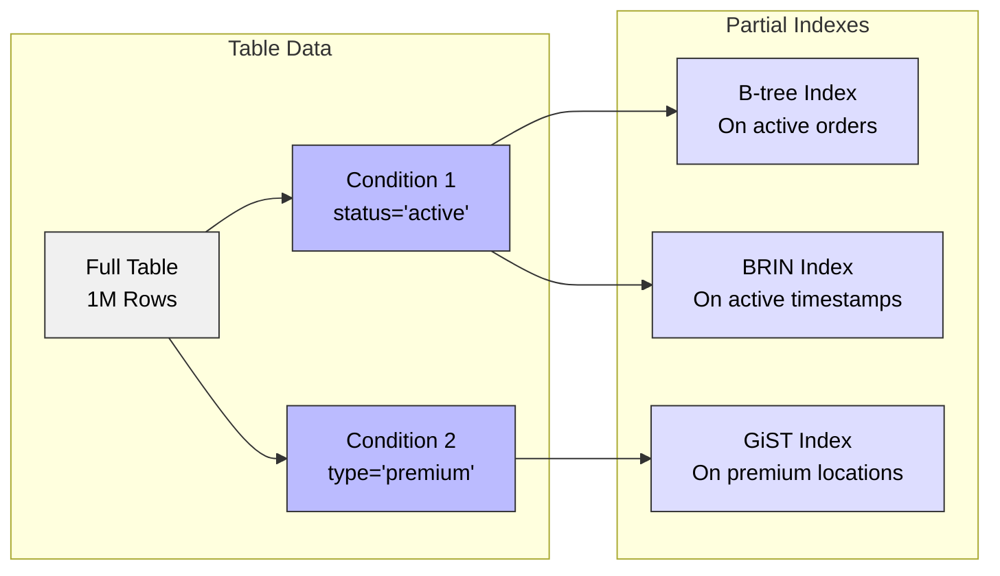

# Partial Indexes in PostgreSQL

## What is a Partial Index?

A partial index is an index built over a subset of rows in a table, defined by a conditional expression (WHERE clause). It allows you to create smaller, more efficient indexes by only including rows that are relevant to your specific query patterns, reducing both storage space and maintenance overhead.

### Partial Index Structure Example



### How Partial Indexes Work with Different Index Types



## When to Use Partial Indexes?

Partial indexes are ideal for:

1. **Filtered Data Access**
   - Active records only
   - Recent data queries
   - Specific status values

2. **Performance Optimization**
   - Reduce index size
   - Lower maintenance overhead
   - Faster index scans

3. **Common Query Patterns**
   - Frequently queried subsets
   - Status-based lookups
   - Date-range filtering

## Why Use Partial Indexes?

### Advantages:
- Smaller index size
- Reduced maintenance overhead
- Better query performance
- Optimized storage usage
- Lower memory requirements
- More efficient updates

### Best For:
- Tables with distinct subsets
- Frequently queried conditions
- Large tables with selective queries
- Mixed workload optimization
- Status-based data access
- Time-based data access

## How to Create Partial Indexes

### Basic Syntax:
```sql
CREATE INDEX index_name ON table_name (column_name)
WHERE condition;
```

### Examples:

1. **Status-Based Index:**
```sql
CREATE INDEX idx_active_orders ON orders(order_date)
WHERE status = 'active';
```

2. **Date Range Index:**
```sql
CREATE INDEX idx_recent_logs ON logs(log_id)
WHERE created_at >= current_date - interval '7 days';
```

3. **Composite Partial Index:**
```sql
CREATE INDEX idx_premium_users ON users(email, created_at)
WHERE account_type = 'premium' AND is_active = true;
```

## Performance Considerations

1. **When Partial Indexes Help:**
   - Selective queries matching the condition
   - Frequent access to specific subsets
   - Large tables with clear data patterns
   - Mixed access patterns

2. **When Partial Indexes Don't Help:**
   - Queries not matching the condition
   - Full table scans
   - Very small tables
   - Random access patterns

## Maintenance

1. **Regular Maintenance:**
```sql
-- Update statistics
ANALYZE table_name;

-- Rebuild index if needed
REINDEX INDEX index_name;
```

2. **Monitoring Usage:**
```sql
SELECT schemaname, tablename, indexname, idx_scan
FROM pg_stat_user_indexes
WHERE indexname LIKE '%partial%';
```

## Best Practices

1. **Index Design:**
   - Choose selective conditions
   - Match common query patterns
   - Consider data distribution
   - Test different conditions

2. **Query Optimization:**
   - Ensure conditions align
   - Use matching WHERE clauses
   - Monitor query plans
   - Review index usage

3. **Maintenance Strategy:**
   - Regular statistics updates
   - Monitor index size
   - Review query patterns
   - Adjust conditions as needed

## Common Use Cases

1. **Active Records**
```sql
CREATE TABLE orders (
    id SERIAL PRIMARY KEY,
    customer_id INTEGER,
    status VARCHAR(20),
    created_at TIMESTAMP
);

CREATE INDEX idx_active_orders 
ON orders(customer_id, created_at)
WHERE status = 'active';
```

2. **Recent Data**
```sql
CREATE TABLE events (
    id SERIAL PRIMARY KEY,
    event_type VARCHAR(50),
    event_date TIMESTAMP
);

CREATE INDEX idx_recent_events 
ON events(event_type, event_date)
WHERE event_date >= current_date - interval '30 days';
```

3. **Premium Content**
```sql
CREATE TABLE content (
    id SERIAL PRIMARY KEY,
    title TEXT,
    type VARCHAR(20),
    published_at TIMESTAMP
);

CREATE INDEX idx_premium_content 
ON content(published_at)
WHERE type = 'premium';
```

## Limitations

1. **Query Restrictions:**
   - Must match index condition
   - No dynamic conditions
   - Limited to static values
   - Condition must be immutable

2. **Maintenance:**
   - Regular statistics updates needed
   - Condition changes require rebuild
   - Multiple indexes may overlap
   - Storage overhead for multiple indexes

3. **Performance:**
   - Only used for matching queries
   - May be ignored by planner
   - Potential for incorrect choices
   - Regular monitoring required

## Advanced Features

1. **Combined with Other Index Types**
```sql
-- Partial GiST index
CREATE INDEX idx_active_locations 
ON stores USING GIST (location)
WHERE status = 'active';
```

2. **Multiple Conditions**
```sql
CREATE INDEX idx_complex_condition 
ON orders(order_date)
WHERE status = 'active' 
  AND order_type = 'retail'
  AND amount > 1000;
```

3. **Expression Indexes**
```sql
CREATE INDEX idx_partial_expression 
ON users((lower(email)))
WHERE active = true;
```

## Tips and Tricks

1. **Condition Testing**
```sql
-- Test if condition is used
EXPLAIN ANALYZE
SELECT * FROM orders
WHERE status = 'active'
  AND created_at >= current_date - interval '7 days';
```

2. **Index Size Comparison**
```sql
-- Compare sizes of full vs partial indexes
SELECT pg_size_pretty(pg_relation_size('idx_full')) as full_size,
       pg_size_pretty(pg_relation_size('idx_partial')) as partial_size;
```

3. **Usage Statistics**
```sql
-- Monitor partial index effectiveness
SELECT relname, idx_scan, idx_tup_read, idx_tup_fetch
FROM pg_stat_user_indexes i
JOIN pg_stat_user_tables t ON i.relid = t.relid
WHERE indexrelname LIKE '%partial%';
```
