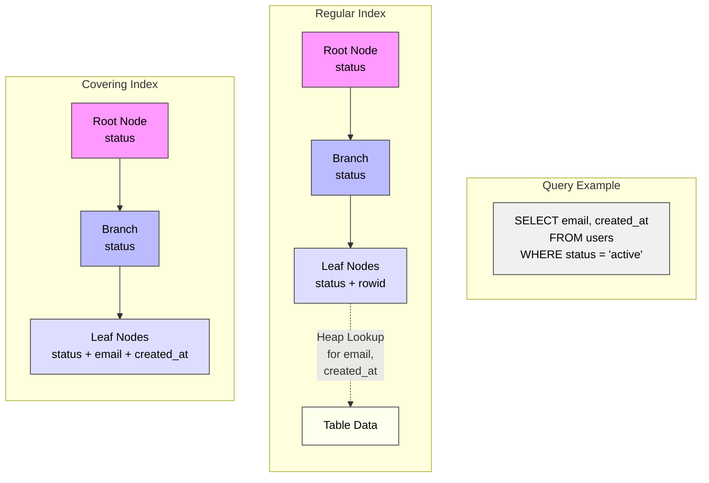
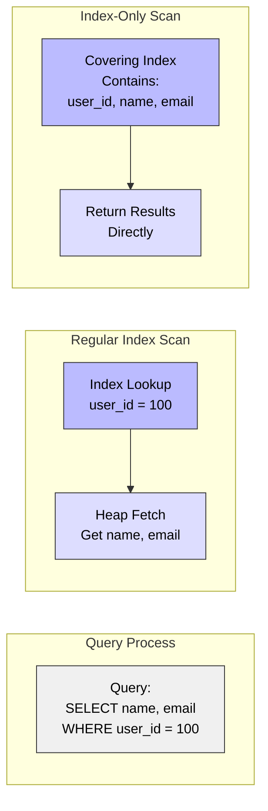

# Covering Indexes in PostgreSQL

## What is a Covering Index?

A covering index (also known as an index-only scan capable index) is an index that includes all the columns needed to satisfy a query without having to look up the actual table data. This is achieved by including additional columns in the index using the INCLUDE clause or as part of a composite index.

### Covering Index Structure Example



### How Covering Indexes Save Table Lookups



## When to Use Covering Indexes?

Covering indexes are ideal for:

1. **Frequent Queries**
   - Common SELECT operations
   - Specific column combinations
   - High-volume read operations

2. **Performance Critical**
   - Latency-sensitive queries
   - High-throughput requirements
   - Reduced I/O operations

3. **Specific Use Cases**
   - Read-heavy workloads
   - Reporting queries
   - API endpoint backing

## Why Use Covering Indexes?

### Advantages:
- Eliminates table lookups
- Reduces I/O operations
- Improves query performance
- Perfect for read-heavy workloads
- Supports index-only scans
- Lower query latency

### Best For:
- Frequently accessed columns
- Read-intensive operations
- Performance-critical queries
- Specific SELECT patterns
- API backend queries
- Report generation

## How to Create Covering Indexes

### Basic Syntax:
```sql
CREATE INDEX index_name ON table_name (column_name) INCLUDE (column1, column2);
```

### Examples:

1. **Simple Covering Index:**
```sql
CREATE INDEX idx_users_email_cover 
ON users(email) 
INCLUDE (name, created_at);
```

2. **Composite Covering Index:**
```sql
CREATE INDEX idx_orders_composite_cover 
ON orders(status, order_date) 
INCLUDE (customer_id, total_amount);
```

3. **Unique Covering Index:**
```sql
CREATE UNIQUE INDEX idx_products_sku_cover 
ON products(sku) 
INCLUDE (name, price, stock);
```

## Performance Considerations

1. **When Covering Indexes Help:**
   - Frequent SELECT queries
   - Specific column combinations
   - Read-heavy workloads
   - Performance-critical operations

2. **When Covering Indexes Don't Help:**
   - Write-heavy workloads
   - Frequently changing data
   - Limited storage space
   - Full table scans

## Maintenance

1. **Regular Maintenance:**
```sql
-- Update statistics
ANALYZE table_name;

-- Monitor index size
SELECT pg_size_pretty(pg_relation_size('index_name'));
```

2. **Verify Index Usage:**
```sql
-- Check for index-only scans
SELECT schemaname, tablename, indexname, 
       idx_scan, idx_tup_read, idx_tup_fetch
FROM pg_stat_user_indexes
WHERE indexname LIKE '%cover%';
```

## Best Practices

1. **Index Design:**
   - Include frequently queried columns
   - Consider storage overhead
   - Balance coverage vs size
   - Monitor query patterns

2. **Query Optimization:**
   - Ensure columns match queries
   - Review execution plans
   - Monitor index usage
   - Consider maintenance overhead

3. **Storage Management:**
   - Monitor index size growth
   - Regular cleanup
   - Balance with other indexes
   - Consider storage costs

## Common Use Cases

1. **User Profile API**
```sql
CREATE TABLE users (
    id SERIAL PRIMARY KEY,
    username VARCHAR(50),
    email VARCHAR(255),
    full_name VARCHAR(100),
    created_at TIMESTAMP
);

CREATE INDEX idx_users_api_cover 
ON users(username) 
INCLUDE (email, full_name, created_at);
```

2. **Order Lookup**
```sql
CREATE TABLE orders (
    id SERIAL PRIMARY KEY,
    order_number VARCHAR(50),
    customer_id INTEGER,
    status VARCHAR(20),
    total_amount DECIMAL
);

CREATE INDEX idx_orders_lookup_cover 
ON orders(order_number) 
INCLUDE (customer_id, status, total_amount);
```

3. **Product Search**
```sql
CREATE TABLE products (
    id SERIAL PRIMARY KEY,
    sku VARCHAR(50),
    name VARCHAR(100),
    price DECIMAL,
    category VARCHAR(50)
);

CREATE INDEX idx_products_search_cover 
ON products(category, price) 
INCLUDE (name, sku);
```

## Limitations

1. **Storage:**
   - Larger index size
   - Increased disk usage
   - Higher maintenance cost
   - Storage space overhead

2. **Maintenance:**
   - More complex updates
   - Slower write operations
   - Regular VACUUM needed
   - Statistics maintenance

3. **Design Constraints:**
   - Limited to B-tree indexes
   - No expression support in INCLUDE
   - Storage vs performance tradeoff
   - Query pattern dependent

## Advanced Features

1. **Combining with Partial Indexes**
```sql
CREATE INDEX idx_active_users_cover 
ON users(email) 
INCLUDE (name, last_login)
WHERE active = true;
```

2. **Multi-Column Ordering**
```sql
CREATE INDEX idx_orders_sort_cover 
ON orders(status, created_at DESC) 
INCLUDE (customer_name, total);
```

3. **Unique Constraints**
```sql
CREATE UNIQUE INDEX idx_unique_cover 
ON products(sku) 
INCLUDE (name, description);
```

## Tips and Tricks

1. **Verify Index-Only Scans**
```sql
-- Check if query uses index-only scan
EXPLAIN (ANALYZE, BUFFERS)
SELECT email, name, created_at 
FROM users 
WHERE email = 'user@example.com';
```

2. **Compare Performance**
```sql
-- Compare with and without covering index
SELECT pg_size_pretty(pg_relation_size('idx_normal')) as normal_size,
       pg_size_pretty(pg_relation_size('idx_covering')) as covering_size;
```

3. **Monitor Usage**
```sql
-- Check index effectiveness
SELECT relname, 
       100 * idx_scan / (seq_scan + idx_scan) as idx_scan_pct
FROM pg_stat_user_tables
WHERE (seq_scan + idx_scan) > 0
ORDER BY idx_scan_pct DESC;
```
