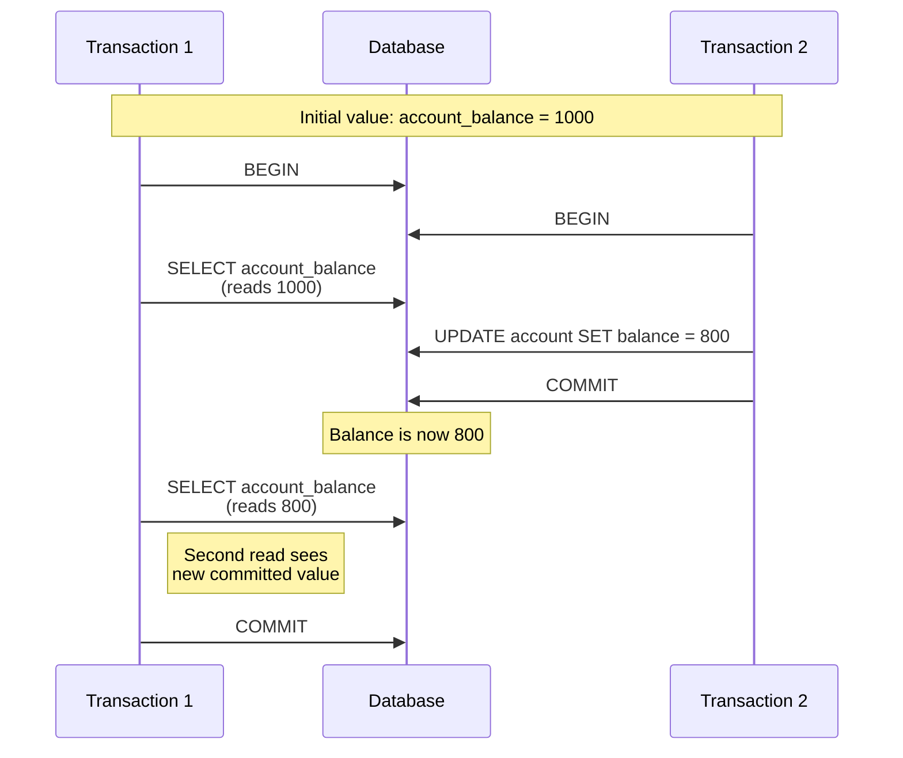
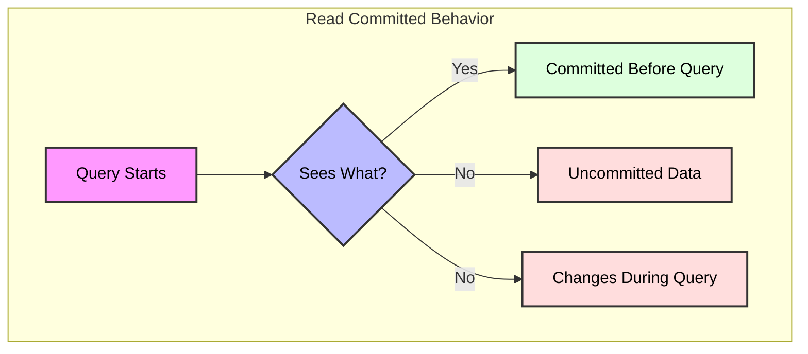
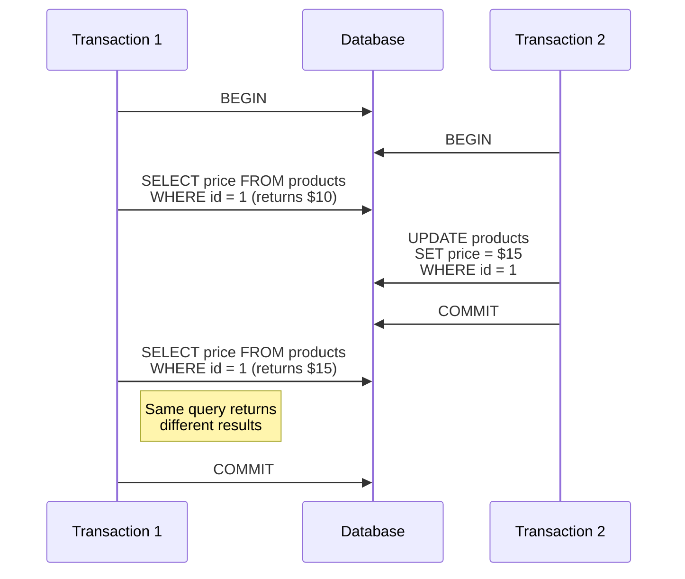
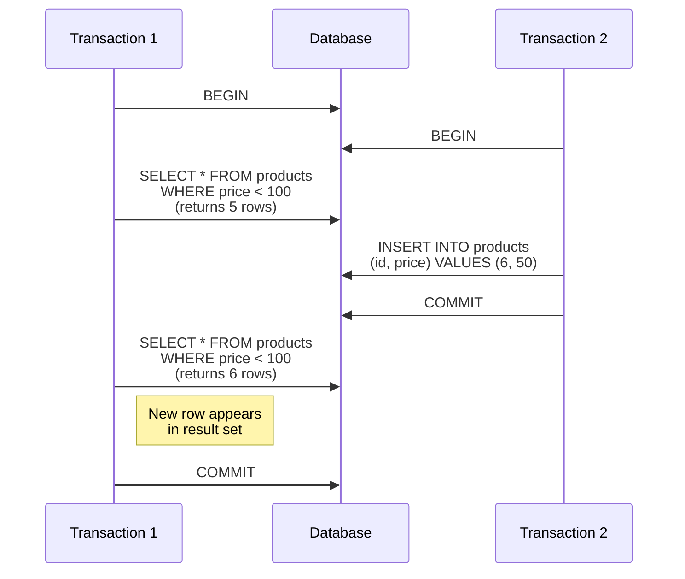

# Read Committed Isolation Level in PostgreSQL

## Overview

Read Committed is the default isolation level in PostgreSQL. In this isolation level:
- Each query sees only data committed before the query began
- A query never sees uncommitted data or changes committed during query execution by concurrent transactions
- Two successive queries in the same transaction might see different data

## Visual Representation



## When to Use Read Committed

### Ideal Use Cases
1. **General Purpose Applications**
   - Default choice for most applications
   - Balanced between consistency and performance
   - Suitable for OLTP systems

2. **Multi-user Applications**
   - Web applications
   - Customer portals
   - Business applications

3. **Reporting Systems**
   - Real-time dashboards
   - Live data monitoring
   - Current state queries

### Common Scenarios
1. **Banking Transactions**
```sql
BEGIN;
-- Check account balance (sees committed data only)
SELECT balance FROM accounts WHERE id = 123;
-- Process withdrawal
UPDATE accounts SET balance = balance - 100 WHERE id = 123;
COMMIT;
```

2. **Inventory Management**
```sql
BEGIN;
-- Check current stock (sees committed data only)
SELECT quantity FROM inventory WHERE product_id = 456;
-- Update stock level
UPDATE inventory SET quantity = quantity - 1 WHERE product_id = 456;
COMMIT;
```

## How It Works

### Key Characteristics



1. **Read Rules**
   - Only sees data committed before query start
   - Never sees uncommitted changes
   - Never sees changes committed during query execution

2. **Write Rules**
   - Writers don't block readers
   - Readers don't block writers
   - Write locks held until commit

## Advantages and Disadvantages

### Pros
1. **Performance**
   - Good concurrency
   - Minimal locking overhead
   - Efficient for read-heavy workloads

2. **Data Consistency**
   - No dirty reads
   - Committed data is always consistent
   - Suitable for most business applications

3. **Usability**
   - Default level
   - Well understood
   - Predictable behavior

### Cons
1. **Non-Repeatable Reads**


2. **Phantom Reads**


## Best Practices

1. **Transaction Design**
   - Keep transactions short
   - Minimize the number of statements
   - Avoid long-running transactions

2. **Error Handling**
```sql
BEGIN;
SAVEPOINT my_savepoint;

-- Attempt operation
UPDATE accounts SET balance = balance - 100 WHERE id = 123;

-- Check if sufficient funds
IF NOT FOUND THEN
    ROLLBACK TO my_savepoint;
    -- Handle insufficient funds
ELSE
    COMMIT;
END IF;
```

3. **Performance Optimization**
   - Use indexes effectively
   - Monitor lock contention
   - Consider batch processing for large operations

## Common Issues and Solutions

1. **Lost Updates**
   Problem: Two transactions updating the same row might lose changes.
   
   Solution:
   ```sql
   BEGIN;
   -- Use SELECT FOR UPDATE to lock the row
   SELECT balance FROM accounts 
   WHERE id = 123 FOR UPDATE;
   
   -- Now safe to update
   UPDATE accounts 
   SET balance = balance - 100 
   WHERE id = 123;
   COMMIT;
   ```

2. **Inconsistent Analysis**
   Problem: Long-running queries might see inconsistent state.
   
   Solution:
   ```sql
   -- Use snapshot export/import for consistent reads
   BEGIN;
   SET TRANSACTION SNAPSHOT transaction_snapshot;
   -- Run analysis queries
   COMMIT;
   ```

## Monitoring and Troubleshooting

1. **Check Transaction State**
```sql
SELECT pid, 
       usename, 
       application_name,
       state,
       query_start,
       wait_event_type
FROM pg_stat_activity
WHERE state = 'active';
```

2. **Monitor Lock Contention**
```sql
SELECT blocked_locks.pid AS blocked_pid,
       blocking_locks.pid AS blocking_pid,
       blocked_activity.query AS blocked_statement
FROM pg_catalog.pg_locks blocked_locks
JOIN pg_catalog.pg_locks blocking_locks 
    ON blocking_locks.locktype = blocked_locks.locktype;
```

## Comparison with Other Isolation Levels

| Feature | Read Committed | Repeatable Read | Serializable |
|---------|---------------|-----------------|--------------|
| Dirty Reads | Prevented | Prevented | Prevented |
| Non-repeatable Reads | Possible | Prevented | Prevented |
| Phantom Reads | Possible | Possible | Prevented |
| Performance | Best | Good | Lowest |
| Concurrency | Highest | Medium | Lowest | 