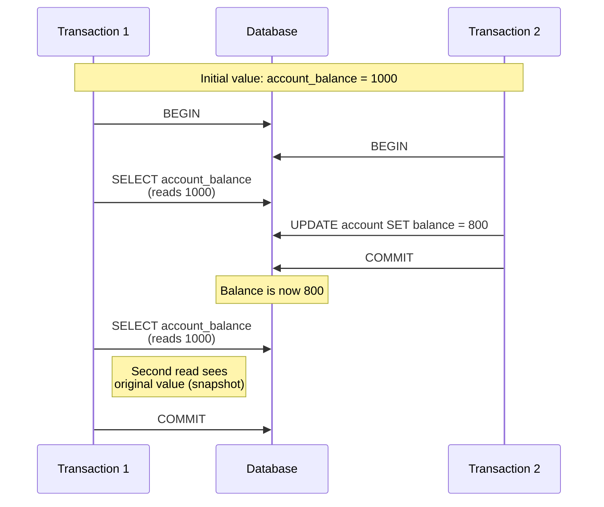
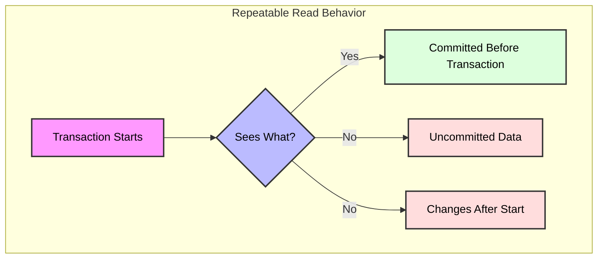
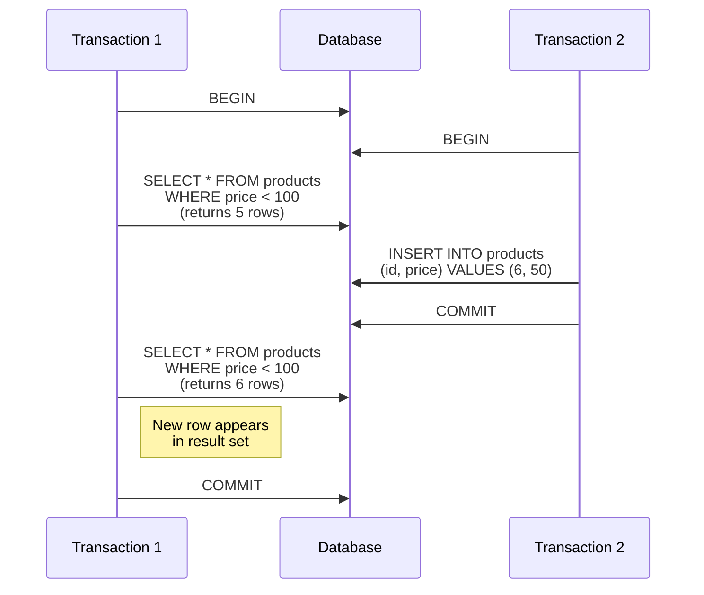

# Repeatable Read Isolation Level in PostgreSQL

## Overview

Repeatable Read is a higher isolation level than Read Committed in PostgreSQL. In this isolation level:
- All statements in a transaction see a consistent snapshot of the database
- No other transactions' changes are visible during the transaction
- Prevents non-repeatable reads, but phantom reads are still possible

## Visual Representation



## When to Use Repeatable Read

### Ideal Use Cases
1. **Financial Applications**
   - Consistent view of data is critical
   - Prevents double-spending or inconsistent balances
2. **Reporting and Analytics**
   - Long-running queries need a stable snapshot
   - Data should not change during analysis
3. **Batch Processing**
   - Multiple related updates/reads must see the same data

### Common Scenarios
1. **Consistent Account Balances**
```sql
BEGIN;
-- First read (sees snapshot)
SELECT balance FROM accounts WHERE id = 123;
-- Even if another transaction updates, this value stays the same
-- Process withdrawal
UPDATE accounts SET balance = balance - 100 WHERE id = 123;
COMMIT;
```

2. **Inventory Audits**
```sql
BEGIN;
-- Take inventory snapshot
SELECT * FROM inventory;
-- Process updates, but reads always see the snapshot
COMMIT;
```

## How It Works

### Key Characteristics



1. **Read Rules**
   - All reads see the same snapshot taken at transaction start
   - No non-repeatable reads
   - No dirty reads
2. **Write Rules**
   - Writers may block each other (serialization failures)
   - Write locks held until commit
   - Phantom reads are possible (new rows may appear in repeated range queries)

## Advantages and Disadvantages

### Pros
1. **Strong Consistency**
   - No non-repeatable reads
   - Stable snapshot for transaction duration
2. **No Dirty Reads**
   - Never sees uncommitted data
3. **Good for Complex Transactions**
   - Suitable for multi-step business logic

### Cons
1. **Phantom Reads**


2. **Serialization Failures**
   - Concurrent updates may cause transaction aborts
   - Must retry aborted transactions

## Best Practices

1. **Transaction Design**
   - Keep transactions short
   - Minimize contention
   - Be prepared to retry on serialization failure
2. **Error Handling**
```sql
BEGIN;
SAVEPOINT my_savepoint;

-- Attempt operation
UPDATE accounts SET balance = balance - 100 WHERE id = 123;

-- Check for errors
-- If serialization failure, ROLLBACK TO my_savepoint and retry
COMMIT;
```
3. **Performance Optimization**
   - Use indexes to reduce lock contention
   - Monitor for serialization failures
   - Batch updates when possible

## Common Issues and Solutions

1. **Serialization Failures**
   Problem: Two transactions try to update the same row, causing one to abort.
   
   Solution:
   ```sql
   BEGIN;
   -- Use SELECT FOR UPDATE to lock the row
   SELECT balance FROM accounts 
   WHERE id = 123 FOR UPDATE;
   -- Now safe to update
   UPDATE accounts 
   SET balance = balance - 100 
   WHERE id = 123;
   COMMIT;
   ```
2. **Phantom Reads**
   Problem: New rows may appear in repeated range queries.
   
   Solution:
   - Use explicit locking (e.g., SELECT ... FOR SHARE/UPDATE)
   - Consider Serializable isolation if phantoms are unacceptable

## Monitoring and Troubleshooting

1. **Check Transaction State**
```sql
SELECT pid, 
       usename, 
       application_name,
       state,
       query_start,
       wait_event_type
FROM pg_stat_activity
WHERE state = 'active';
```
2. **Monitor Serialization Failures**
```sql
SELECT * FROM pg_stat_database_conflicts WHERE confl_lock > 0;
```

## Comparison with Other Isolation Levels

| Feature | Read Committed | Repeatable Read | Serializable |
|---------|---------------|-----------------|--------------|
| Dirty Reads | Prevented | Prevented | Prevented |
| Non-repeatable Reads | Possible | Prevented | Prevented |
| Phantom Reads | Possible | Possible | Prevented |
| Performance | Best | Good | Lowest |
| Concurrency | Highest | Medium | Lowest |
