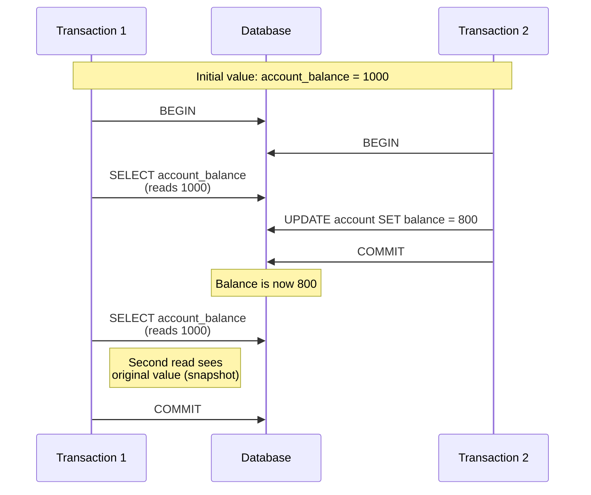
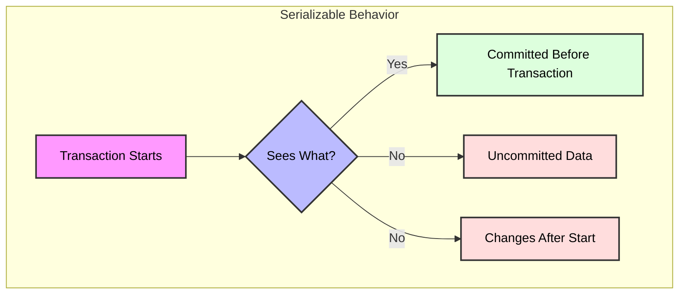

# Serializable Isolation Level in PostgreSQL

## Overview

Serializable is the strictest isolation level in PostgreSQL. In this isolation level:
- Transactions are executed as if they were run one after another (serially)
- Prevents dirty reads, non-repeatable reads, and phantom reads
- Ensures full serializability, but may cause more transaction rollbacks

## Visual Representation



## When to Use Serializable

### Ideal Use Cases
1. **Critical Financial Systems**
   - Absolute consistency is required
   - Prevents all anomalies
2. **Complex Business Logic**
   - Multi-step workflows that must be isolated
3. **Regulatory Compliance**
   - Environments where data anomalies are unacceptable

### Common Scenarios
1. **Transfer Between Accounts**
```sql
BEGIN;
-- Read balances (sees snapshot)
SELECT balance FROM accounts WHERE id = 123;
SELECT balance FROM accounts WHERE id = 456;
-- Transfer funds
UPDATE accounts SET balance = balance - 100 WHERE id = 123;
UPDATE accounts SET balance = balance + 100 WHERE id = 456;
COMMIT;
```

2. **Order Processing**
```sql
BEGIN;
-- Check inventory and place order atomically
SELECT quantity FROM inventory WHERE product_id = 789;
UPDATE inventory SET quantity = quantity - 1 WHERE product_id = 789;
INSERT INTO orders (product_id, qty) VALUES (789, 1);
COMMIT;
```

## How It Works

### Key Characteristics



1. **Read Rules**
   - All reads see the same snapshot taken at transaction start
   - No dirty reads, non-repeatable reads, or phantom reads
2. **Write Rules**
   - Writers may block each other
   - Serialization failures are more common
   - Transactions may be rolled back to maintain serializability

## Advantages and Disadvantages

### Pros
1. **Full Consistency**
   - Prevents all read anomalies
   - Transactions behave as if executed serially
2. **No Dirty Reads, Non-repeatable Reads, or Phantoms**
   - Strongest isolation guarantee
3. **Ideal for Critical Workloads**
   - Suitable for high-integrity systems

### Cons
1. **Performance Overhead**
   - More locking and checks
   - Lower throughput than other levels
2. **Serialization Failures**
   - Higher chance of transaction aborts
   - Applications must handle retries

## Best Practices

1. **Transaction Design**
   - Keep transactions as short as possible
   - Minimize contention
   - Be prepared to retry on serialization failure
2. **Error Handling**
```sql
BEGIN;
SAVEPOINT my_savepoint;

-- Attempt operation
UPDATE accounts SET balance = balance - 100 WHERE id = 123;

-- If serialization failure, ROLLBACK TO my_savepoint and retry
COMMIT;
```
3. **Performance Optimization**
   - Use only when necessary
   - Monitor for serialization failures
   - Optimize queries and indexing

## Common Issues and Solutions

1. **Serialization Failures**
   Problem: Two transactions conflict, causing one to abort.
   
   Solution:
   ```sql
   BEGIN;
   -- Use SELECT FOR UPDATE to lock the row
   SELECT balance FROM accounts 
   WHERE id = 123 FOR UPDATE;
   -- Now safe to update
   UPDATE accounts 
   SET balance = balance - 100 
   WHERE id = 123;
   COMMIT;
   ```
2. **Throughput Bottlenecks**
   Problem: High contention leads to slowdowns.
   
   Solution:
   - Reduce transaction scope
   - Batch operations where possible
   - Use lower isolation level if safe

## Monitoring and Troubleshooting

1. **Check Transaction State**
```sql
SELECT pid, 
       usename, 
       application_name,
       state,
       query_start,
       wait_event_type
FROM pg_stat_activity
WHERE state = 'active';
```
2. **Monitor Serialization Failures**
```sql
SELECT * FROM pg_stat_database_conflicts WHERE confl_lock > 0 OR confl_serialization_failure > 0;
```

## Comparison with Other Isolation Levels

| Feature | Read Committed | Repeatable Read | Serializable |
|---------|---------------|-----------------|--------------|
| Dirty Reads | Prevented | Prevented | Prevented |
| Non-repeatable Reads | Possible | Prevented | Prevented |
| Phantom Reads | Possible | Possible | Prevented |
| Performance | Best | Good | Lowest |
| Concurrency | Highest | Medium | Lowest |
