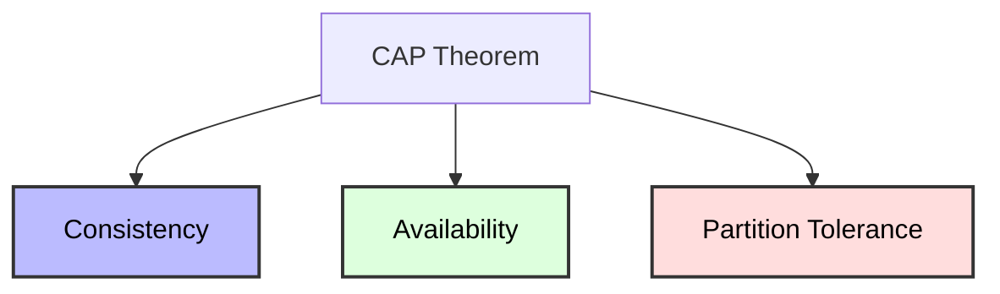
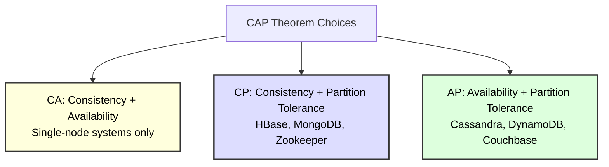
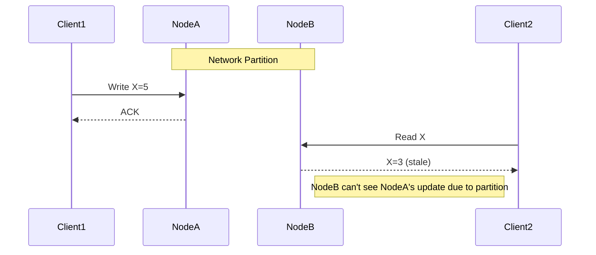

# CAP Theorem in Distributed Databases

## Overview

The **CAP Theorem** (also known as Brewer's Theorem) is a fundamental principle in distributed systems, especially distributed databases. It states that a distributed system can only guarantee two out of the following three properties at any given time:

- **Consistency (C)**
- **Availability (A)**
- **Partition Tolerance (P)**

This theorem has profound implications for the design and operation of distributed databases.

## The Three Properties

### 1. Consistency (C)
Every read receives the most recent write or an error. In database terms, this means all nodes see the same data at the same time. If a write is acknowledged, any subsequent read will return that value or an error.

### 2. Availability (A)
Every request (read or write) receives a (non-error) response, even if some nodes are down. The system remains operational and responsive.

### 3. Partition Tolerance (P)
The system continues to operate despite arbitrary network partitions (communication breakdowns between nodes). This is essential in distributed systems, as network failures are inevitable.

## Visual Representation

Or, showing the possible combinations:

## Implications in Distributed Databases

### Why Can't We Have All Three?
When a network partition occurs (nodes can't communicate), a distributed database must choose between:
- **Consistency:** Refuse requests that can't guarantee the latest data (sacrificing availability)
- **Availability:** Respond to requests with possibly stale data (sacrificing consistency)

Partition tolerance is non-negotiable in real-world distributed systems, so the real trade-off is between consistency and availability during partitions.

### Database Examples
- **CP (Consistency + Partition Tolerance):**
  - Systems like HBase, MongoDB (with strong consistency settings), and Zookeeper
  - Prioritize data correctness over availability
  - May reject requests during partitions
- **AP (Availability + Partition Tolerance):**
  - Systems like Couchbase, DynamoDB, Cassandra (with eventual consistency)
  - Prioritize uptime and responsiveness
  - May serve stale data during partitions
- **CA (Consistency + Availability):**
  - Only possible if there are no partitions (single-node or tightly coupled systems)
  - Not achievable in a truly distributed system

## CAP in Practice

### Scenario: Network Partition
Suppose a distributed database is split into two groups due to a network failure. Now:
- If the system chooses **Consistency**, it must reject requests that can't guarantee the latest data (some nodes are unreachable).
- If the system chooses **Availability**, it must respond to requests, even if it can't guarantee the latest data (some nodes are unreachable).

### Example Diagram

## Deep Dive: Consistency Models

- **Strong Consistency:** All nodes reflect the same data after a write (e.g., linearizability)
- **Eventual Consistency:** All nodes will eventually reflect the same data, but may be temporarily inconsistent
- **Causal Consistency:** Writes that are causally related are seen by all nodes in the same order

Distributed databases often allow tuning the consistency/availability trade-off (e.g., quorum reads/writes in Cassandra, read/write concerns in MongoDB).

## Best Practices
- Choose the right trade-off for your application's needs
- Understand the failure modes of your database
- Use appropriate consistency settings for critical data
- Monitor for partitions and handle them gracefully

## Summary Table

| System Type | Consistency | Availability | Partition Tolerance |
|-------------|-------------|--------------|---------------------|
| CA          | Yes         | Yes          | No                  |
| CP          | Yes         | No           | Yes                 |
| AP          | No          | Yes          | Yes                 |

## References
- Eric Brewer, "CAP Twelve Years Later: How the 'Rules' Have Changed" ([InfoQ, 2012](https://www.infoq.com/articles/cap-twelve-years-later-how-the-rules-have-changed/))
- Seth Gilbert and Nancy Lynch, "Perspectives on the CAP Theorem" ([MIT DSpace PDF, 2012](https://dspace.mit.edu/bitstream/handle/1721.1/79112/Brewer2.pdf)) 