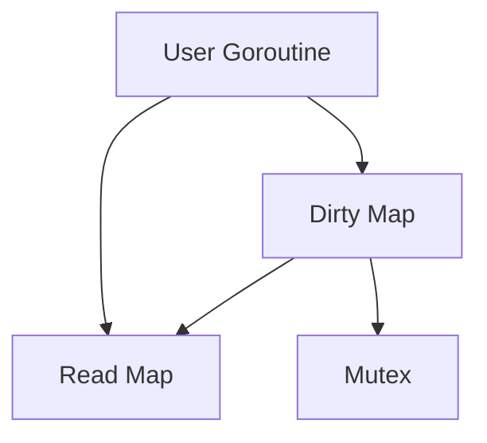

# sync.Map in Go

## Overview

`sync.Map` is a concurrent map implementation provided by Go's `sync` package. Unlike the built-in `map`, which is not safe for concurrent use by multiple goroutines, `sync.Map` is designed for concurrent access without requiring explicit locks in most cases.

## When to Use `sync.Map`
- When you need a map that is accessed by many goroutines concurrently.
- When the keys are stable (not frequently deleted).
- When you have a read-heavy workload (many reads, fewer writes).
- For caches, memoization, or storing shared state in concurrent programs.

## API

The main methods of `sync.Map` are:
- `Store(key, value interface{})` — Sets the value for a key.
- `Load(key interface{}) (value interface{}, ok bool)` — Gets the value for a key.
- `LoadOrStore(key, value interface{}) (actual interface{}, loaded bool)` — Gets the value if present, otherwise stores and returns the new value.
- `Delete(key interface{})` — Removes the key and its value.
- `Range(f func(key, value interface{}) bool)` — Iterates over all key-value pairs.

### Example Usage
```go
import (
    "fmt"
    "sync"
)

func main() {
    var m sync.Map
    m.Store("foo", 42)
    value, ok := m.Load("foo")
    if ok {
        fmt.Println("foo:", value)
    }
    m.Delete("foo")
}
```

## Internal Structure

`sync.Map` uses a combination of two maps and a set of locks to optimize for concurrent access:
- **Read Map**: An immutable map for fast, lock-free reads.
- **Dirty Map**: A regular map protected by a mutex for writes and updates.
- **Misses Counter**: Tracks how many times a key was not found in the read map, promoting it to the dirty map when necessary.

### How It Works
- Reads first check the read map (lock-free, fast path).
- If not found, they check the dirty map (slow path, with locking).
- Writes go to the dirty map and may eventually promote the dirty map to the read map.

## Diagram: sync.Map Structure



## Concurrency Properties
- **Lock-free reads** for keys in the read map.
- **Mutex-protected writes** for updates and new keys.
- **No need for user locks** in most cases.
- **Safe for concurrent use** by multiple goroutines.

## Performance Considerations
- Best for read-heavy workloads.
- Frequent deletions or high write contention may reduce performance.
- For write-heavy or small maps, a `sync.RWMutex` with a regular map may be faster.

## Limitations
- Keys and values are of type `interface{}` (no generics until Go 1.18+).
- No type safety; you must cast values.
- Not as efficient for small or write-heavy maps.

## Alternatives
- `map` with `sync.RWMutex` for custom locking and type safety.
- Third-party concurrent map libraries (with generics in Go 1.18+).

## References
- [Official sync.Map documentation](https://pkg.go.dev/sync#Map)
- [Go Blog: sync.Map](https://blog.golang.org/sync-map)
